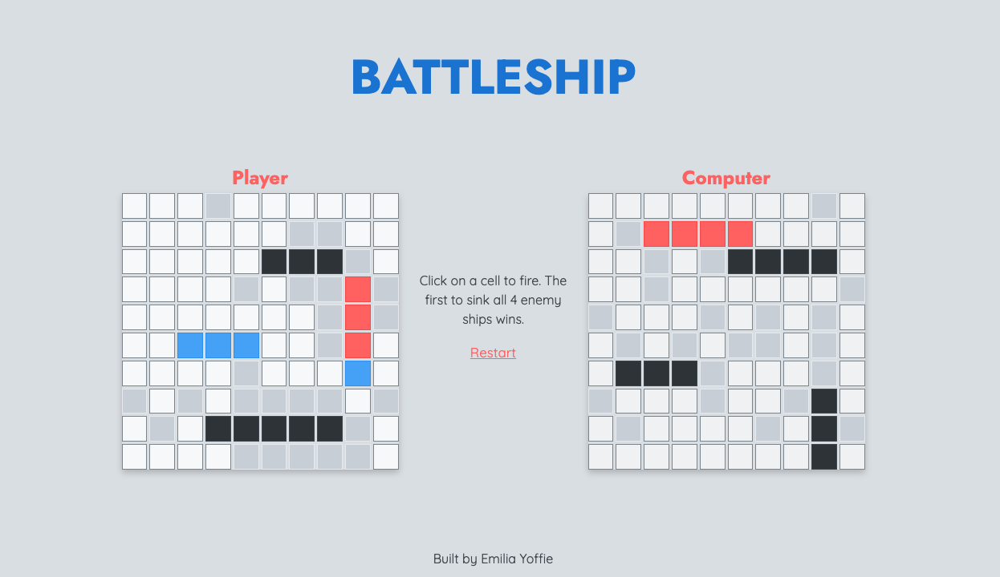

# Battleship

A simplified version of the classic Battleship game. A work in progress.

## Overview

A single player is allowed to play against a computer opponent. The computer makes random moves, though once it has successfully hit a ship, it targets the surrounding cells to try until the ship has been sunk.

The opponent has a board of their own which the user can see, but cannot see the ships for (unless they land a hit), similar to a standard battleship game.

---

### Tech Stack

- TypeScript
- React + OpenColor + CSS
- Node.js + Vite
- Jest + React Testing Library

## Installation

1. Clone the repo & install it locally
2. Run `npm install` to grab all of the necessary dependencies
3. From the installed directory, run `npm run dev` - Vite will spin up a local dev server (likely on localhost:5173).
4. Navigate to the page, and start playing Battleship!

